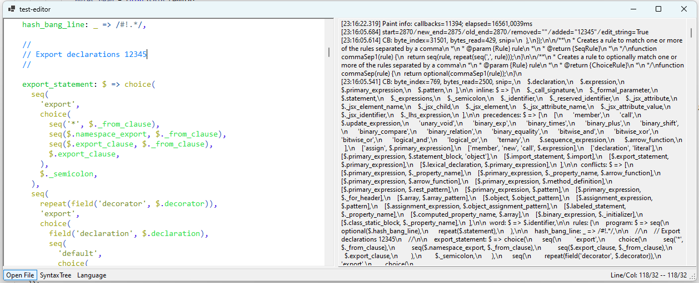

# TreeSitter Demo Editor

This repository contains a simple [tree-sitter](https://tree-sitter.github.io/tree-sitter/) wrapper library written in C,
and a C# based WinForms based editor, which integrates to it using P/Invoke,
which demonstrates the basic ideas required for hosting and utilizing
tree-sitter to perform syntax-highlighting.

This has been tested on Windows 11, using VS2022.

## Build

- Initialize the git submodules (`git submodule init` and `git submodule update`)
- Run `build.bat` in the Developer Command Prompt for VS 2022 (careful to use the 64bit version of `CL.EXE`)
- Open `test-editor.sln` and press F5
- Dart ffi example can be running `dart run main.dart` in the `dart` folder

## Notes

- Editor performance is quite poor, since it "just" builds on the RichTextBox control.
